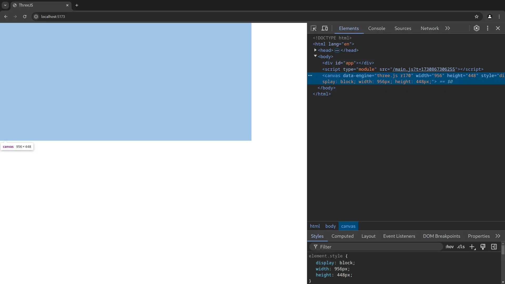
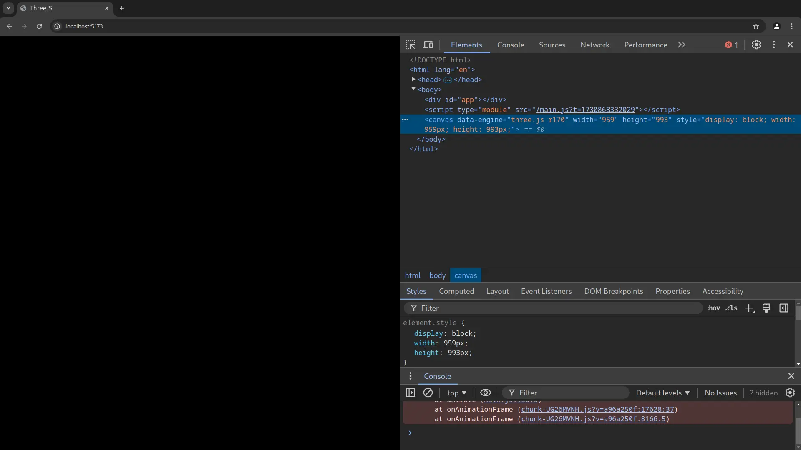
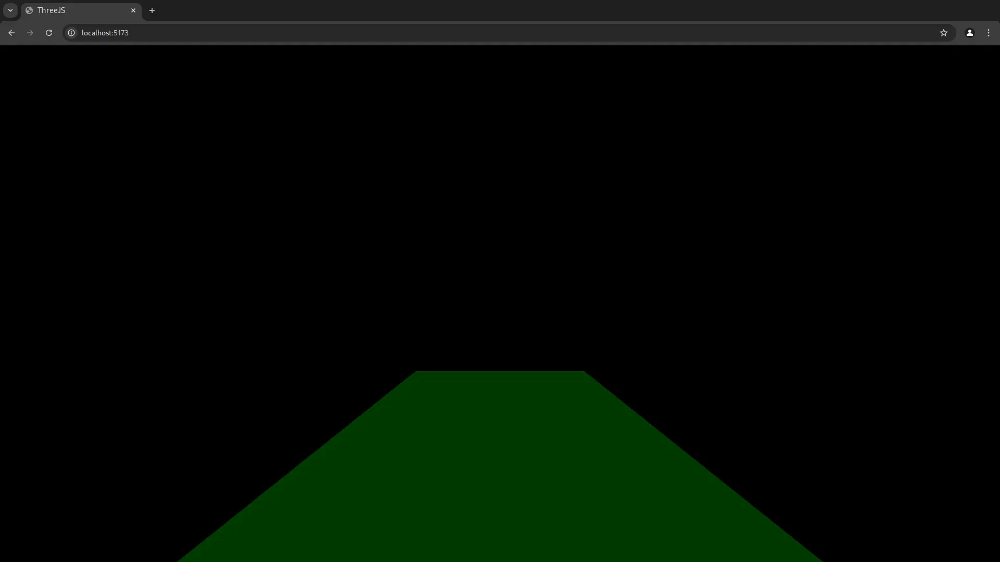
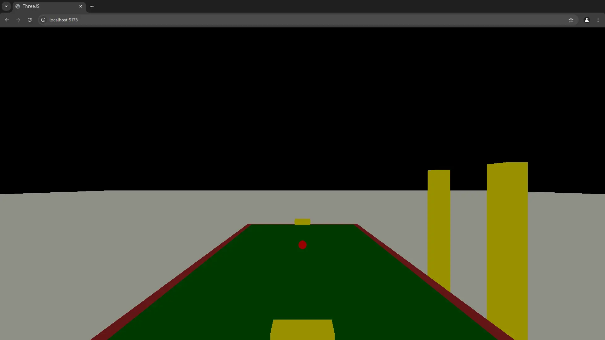
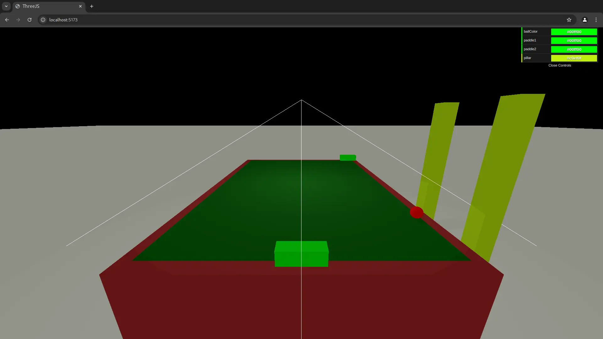
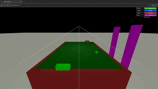
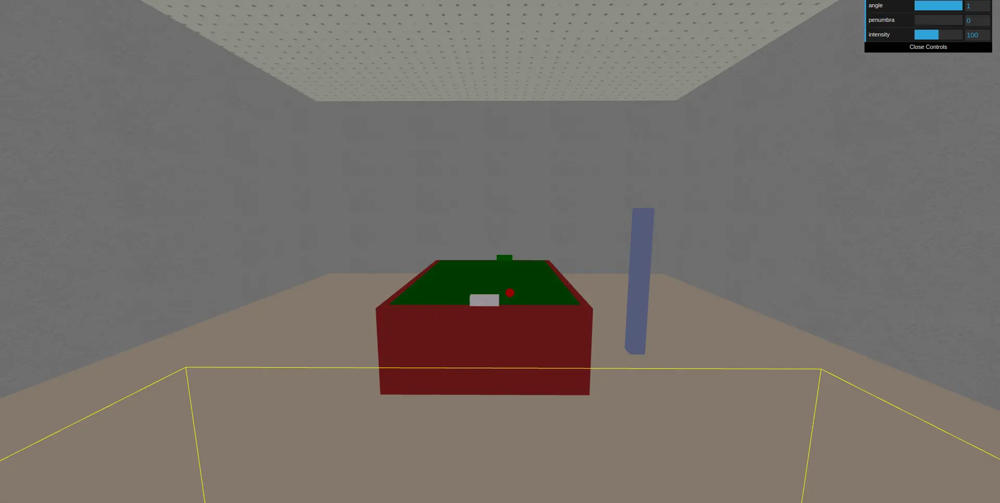
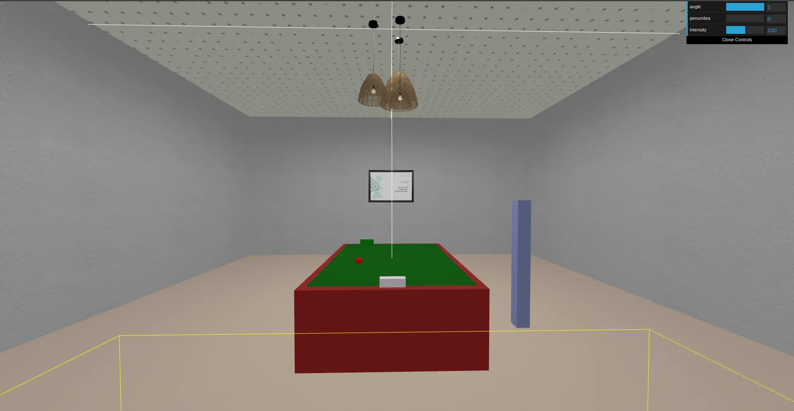

# دراسة عن مكتبة `Three.js`

## إعداد وإشراف البحث

البحث من إعداد الطلاب: **[محمد معراوي](https://t.me/Mohammed_marawi)** (8) - **[محمد حمزة الشمالي](https://t.me/MohammadHamzaAl_Shamali)** (7) - **[عبد الرحمن رحال](mailto:arrahhal@proton.me)** (4)

إشراف الدكتور: **ماهر سلامة**

## محاور البحث

يدرس هذا البحث مكتبة [`Three.js`](https://threejs.org)، ويقدم تعريفًا موجزًا عنها وعن مبادئ استخامها. ويذكر في المقدمة عددًا من تطبيقاتها من الواقع. ثم ينفذ برنامجًا يستخدم فيه إجرائياتها الأساسية ويشرحها خطوة خطوة ويقيم تجربة التطوير فيها، أخيرًا يذكر بعض الصعوبات التي ترافق تلك التجربة.

## مقدمة

### تعريف بمكتبة `Three.js`؟

هي مكتبة للرسم ثلاثي الأبعاد داخل متصفحات الويب، وهي كما هو ظاهر من اسمها مبنية بلغة جافاسكربت، وكنتيجة لشهرة وقوة اللغة وكثرة مكتباتها ولتوفر متصفحات الويب على كل الأجهزة فإن هذا يجعل المكتبة مستخدمة بشكل كبير نظرًا لاستهدافها شريحة عريضة من مستخدمي الويب والمبرمجين على حد سواء.

بدأ مشروع المكتبة عام ٢٠١٠ كبرمجية مفتوحة المصدر على [موقع جت هب](https://github.com/mrdoob/three.js) لكاتبها Ricardo Cabello، وتصلها التحديثات والتطويرات من المجتمع إلى يومنا بشكل كثيف، وقد حصلت إلى وقت كتابة هذا البحث على أكثر من ١٠٢ ألف نجمة على الموقع جت هب بفارق أكثر من ٧٠ ألف نجمة عن أقرب نظيراتها `Babylon.js` وأكثر من ٤٤ ألف إيداع مجتمعي على الكود، وعدد من المساهمين يقارب الألفين. مثل هذه الأرقام تجعل منها اختيار موثوق ومستقر وذات دعم في المستقبل.

### استخدامات مكتبة `Three.js`

سنذكر بعضًا من تطبيقاتها المثيرة للاهتمام من التطبيقات التي لا حصر لها للمكتبة في برمجيات الويب لنعطي للقارئ لمحة عن ما هو متاح:

- **النمذجة ثلاثية الأبعاد لبضائع المتاجر الإلكترونية**
- **تصاوير ثلاثية الأبعاد للكرة الأرضية والخرائط** وذلك لعرض إحصائيات عددية أو أحوال الطقس في البلدان
- **برمجة الألعاب العابرة للأنظمة** والتي تعمل على كل جهاز فيه متصفح ويب

وما هذه الأمثلة إلا غيض من فيض الإمكانيات التي تتيحها المكتبة.

وفقًا لموقع `builtwith` فإن أكثر من ١٧٠٠٠ موقع حيّ ومسجل يستخدم `Three.js` وأكثر من ١٨٠,٠٠٠ سبق واستخدم المكتبة. ومن ينظر إلى الساحة التقنية اليوم، وما يستجد فيها من تقنيات تعتمد الرسم الثلاثي الأبعاد يعلم أن الحاجة إلى المكتبة واستخدامها صاعد في ازدياد، وكما أصبحت كثير من تقنيات الـ`3D` مثل الـ`VR` (الواقع الافتراضي) ونظارات الواقع المعزز واقعا ليس لنا غنًى عنه، ستزداد حاجتنا إلى تقنيات الـ`3D` في برمجيات الويب يومًا بعد يوم بلا شك.

### بنية مكتبة `Three.js` ومقارنتها مع `WebGL API`.

بنيت مكتبة `Three.js` في الأساس على الواجهة البرمجية `WebGL` ([والمدعومة من جميع المتصفحات الحديثة تقريبا](https://developer.mozilla.org/en-US/docs/Web/API/WebGL_API#browser_compatibility))، التي تفتح لها قناة للتواصل مع معالج الرسوميات، ولما كانت `WebGL` واجهة منخفضة المستوى كانت كتابة البرمجيات بهذه الواجهة صعبة جدًا إذ أنها تكتفي برسم [النقاط والخطوط والمثلثات](https://developer.mozilla.org/en-US/docs/Web/API/WebGLRenderingContext/drawArrays)، لتنفيذ رسومات يسيرة بكود الـ `WebGL` نحتاج إلى عدد كبير جدًا من الأسطر البرمجية والخوض في الكثير من التفاصيل التي لا يفهمها إلا الخبراء، وهذه تجربة غير مريحة لعموم المبرمجين، لذلك فإن مكتبة تحل محل طبقة عالية المستوى تقلل عدد الأسطر التي يحتاجها الإنشاء الرسومي من خلال ما تقدمه من إجرائيات وأغراض شائعة الاستخدام، مثلًا يحتاج إنشاء [مكعب بسيط بـ `WebGL` إلى ما يقارب الـ 200 سطر](https://github.com/mdn/dom-examples/tree/main/webgl-examples/tutorial/sample5)، بينما بالإمكان تحقيق نتيجة أفضل ببضعة أسطر مع `Three.js`.

## تجربة التطوير في ThreeJS

### إنشاء لعبة «طاولة الصد»

سنقوم في هذا القسم بإنشاء لعبة بسيطة شبية بألعاب الـ `ping-pong` والـ [`air-huckey`](https://en.wikipedia.org/wiki/Air_hockey)، وقد سميناها طاولة الصد. ومشهد اللعبة هو غرفة مغلقة وفي وسطها طاولة على كل جانب منها عارضة تتحرك حركة أفقية يسارًا ويمينا لتمنع الكرة من النفوذ من جانب الطاولة. في الجدار الأمامي للغرفة صورة غلاف للبحث وأسماء الطلاب المعدين، وعلى السقف العلوي لمبات متدلية تنير الطاولة ويصل نورها إلى جدران الغرفة.

 الرؤية منظورية وتتحرك بالأحرف `W` `S` `D` `A` إلى الأمام والخلف واليمين واليسار على الترتيب والرؤية تتبع اتجاه الفأرة، أما العارضة فتتحرك بالأسهم إلى اليمين واليسار.

### إعداد مشهد العرض

سنضيف بعضًا من المكونات التجهيزية والتي لا تُرى في المشهد ولكنها ضرورية لتظهر بقية الأغراض بشكل جيد.
```javascript
import * as THREE from "three";

// هو الحاوية لبقية عناصر المشهد
const scene = new THREE.Scene();
// كاميرا منظورية تظهر العمق (الأشياء البعيدة أصغر من حجمها الحقيقي مثل عين الإنسان)
const camera = new THREE.PerspectiveCamera(
  75, // زاوية مجال الرؤية
  window.innerWidth / window.innerHeight, // نسبة العرض إلى الطول
  0.1, // سطح الرؤية القريب
  1000,// سطح الرؤية البعيد
);

// المصيّر الذي يحول الرسومات إلى مشهد حي
const renderer = new THREE.WebGLRenderer();
renderer.setSize(window.innerWidth, window.innerHeight);
// الـ`domElement` يمثل الـ canvas في الـ html
document.body.appendChild(renderer.domElement);
```

النيجة: إضافة عنصر الـ`canvas` فارغ إلى الصفحة



### تحريك المشهد

حتى نجعل المصيّر يعيد رسم المشهد لمواكبة التغيرات ورسمها على الشاشة سنضيف إجرائية الـ `renderer.setAnimationLoop` وذلك بإضافة ما يلي
```javascript
function animate() {
  renderer.render(scene, camera);
}

renderer.setAnimationLoop(animate);
```
*بدون هذه الخطوة، لن تُرسم أي من العناصر على الشاشة لأن الكاميرا غير مربوطة بالمشهد*

### إضافة غرض إلى المشهد

كما في كثير من مكتبات الرسم ثلاثي الأبعاد فإن لكل غرض مرئي في المشهد له أمرين
- `Geometry`: يحدد شكل الغرض في الفراغ (مكعب، كرة، ...إلخ)
- `Material`: هي المادة التي تغطي الأبعاد وتعطي الغرض لونه وتحدد خصائص تفاعله مع الضوء.
ولإنشاء الغرض نستدعي الـ `Mesh` وهو الغرض نفسه (بدمج الـ‌Geomtry & Material)
عندها يصبح بإمكاننا استدعاء الإجرائيات التي يوفرها `Three.js` API للوصول أو تعديل تموضع وحركة الغرض في مساحة العرض
وهذا مثال يغطي ما سبق وذكرناه عن الطريقة العامة لإنشاء الأغرض
```javascript
// شكل مستطيلي يمثل المساحة التي تجري عليها الكرة
const planeGeomtry = new THREE.PlaneGeometry(20, 30);
// الـ StrandardMaterial يفيد في استقبال وعكس الغرض للظلال عكس الـ basicMaterial الذي لا يوفر هذه الخصائص
const planeMaterial = new THREE.MeshStandardMaterial({
  color: "darkgreen",
  side: THREE.DoubleSide,
});
// إنشاء الغرض بدمج الشكل والمادة
const plane = new THREE.Mesh(planeGeomtry, planeMaterial);

// تعديل حركات وتموضع مساحة اللعب من خلال الإجرائيات الـObject
plane.rotation.x = -0.5 * Math.PI;
plane.receiveShadow = true;
// إضافته إلى المشهد الذي سبق وأنشأناه
scene.add(plane);
```

النتيجة: السطح الذي أضفناه لم يظهر بسبب انعدام الإضاءة (الـ standardMaterial تحتاج ضوء لتظهر)، كما نحتاج إلى تنحية الكاميرا إلى الخلف لتلقط العناصر المضافة بشكل صحيح.



### الأضواء

توفر `Three.js` أنوعا عدة من الأضواء ولكل منها سلوك مختلف

- `ambientLight`: يؤثر على كل الأغراض بدرجة واحدة وليس له اتجاه لذا فهو لا ينشئ عنه ظلال.
- `spotLight`: نقطة تنشر الضوء في اتجاه معين، وتزيد المساحة التي يغطيها بزدياد البعد عن تلك النقطة. بإمكان هذا النوع من الضوء إنشاء الظلال.
- `directionalLight`: يشبه ضوء النهار، من حيث الاتجاه المحدد للأشعة ومن حيث أن الشمس على بعد غير نهائي من الأرض.  بإمكان هذا النوع من الضوء إنشاء الظلال أيضًا.

### إضافة ضوء وتعديل موضع الكاميرا

نضيف ضوءا من نوع `ambientLight` حتى يظهر الشكل على الكاميرا، كما نسحب الكاميرا إلى الخلف والأعلى لنحصل على لقطة أفضل للمشهد.
```javascript
camera.position.set(0, 8, 25);
const ambientLight = new THREE.ambientLight();
scene.add(ambientLight);
```

النتيجة:



### إضافة بقية الأغراض اللازمة

بنفس الطريقة إنشاء وإضافة مساحة اللعب إلى المشهد ننشئ ما نحتاجه من مكونات
```javascript
const planeGeomtry = new THREE.PlaneGeometry(20, 30);
// ....
scene.add(plane);

const sphereGeometry = new THREE.SphereGeometry(0.5);
// ....
scene.add(ball);

// ....
```

النتيجة:



### إضافات لتسهيل وإصلاح الأخطاء في المشهد

الكاميرا الثابتة تمنعنا من رؤية المكونات التي أضفناها فيما إن كانت كما أردنا لها أن تكون، وأيضا هناك بعض القيم التي نحتاج تعديلها باستمرار لداعي الاختبار والتجربة.
نضيف إمكانية تحريك الكاميرا باستخدام بعض المتحكمات المضمنة في المكتبة:
```javascript
import { OrbitControls } from "three/examples/jsm/controls/OrbitControls";

const orbit = new OrbitControls(camera, renderer.domElement);
scene.add(orbit);

camera.position.set(0, 8, 25);
orbit.update(); // !نحتاج إلى تحديث الموضع في المتحكم عند كل تعديل يدوي لموضع الكميرا

```

نضيف مكتبة dat.gui لتعديل قيم المتحولات بشكل آني وقت التشغيل:
```javascript
import * as dat from "dat.gui";

// واجهة صغيرة في أعلى يمين الشاشة للتحكم بالقيم التي نختارها
const gui = new dat.GUI();
const options = {
  planeColor: "#00ff00",
};

plane.material.color.set(options.planeColor);
// إضافة حدث لمراقبة التغيرات في لون السطح وإجراء التعديل المناسب لتغييره
gui.addColor(options, "planeColor").onChange(e => plane.material.color.set(e));
```

### إضافة مساعدات لإظهار الأماكن والمساحات التي تشغلها بعض الأغراض

بعض الأغراض (لا سيما غير المرئية مثل الأضواء) يصعب تحديد مكانها والمساحة التي تغطيها بدون خطوط مساعدة، [وهناك العديد من المساعدات](https://threejs.org/docs/?q=helper) وكل منها يستخدم مع الغرض الذي يقابله، سنذكر مساعد الـ `SpotLight` مثالًا:
```javascript
const spotLight = new THREE.SpotLight(0xffffff, 100);
spotLight.position.set(0, 10, 0);
spotLight.castShadow = true;
scene.add(spotLight);

scene.add(spotLight);

const sLightHelper = new THREE.SpotLightHelper(spotLight);
scene.add(sLightHelper);

// نضيف إظهار/إخفاء هذا المساعد إلى واجهة GUI()
sLightHelper.visible = options.enableHelpers;
```

النتيجة:



### نضيف إجرائيات تحريك الكرة والمضارب:

دالة الـ `animate` ستدعي هذه الدوال بشكل دوري، وهذه الدوال هي التي تتحكم بحركة الكرة والمضارب، هنا قسم من الكود يوضح عمل الـ`ballLogic funciton`:
```javascript
function animate() {
// ....
  ballLogic();
  paddleLogic();
  // ...
}

let ballDirX = 1;
let ballDirZ = 1;
let ballSpeed = 0.1;

function ballLogic() {
  if (ball.position.z <= -15) {
    resetBall(2);
  } else if (ball.position.z >= 15) {
    resetBall(1);
  } else if (ball.position.x < -9.5) {
    ballDirX = -ballDirX;
  } else if (ball.position.x > 9.5) {
    ballDirX = -ballDirX;
  }

  ball.position.x += ballDirX * ballSpeed;
  ball.position.z += ballDirZ * ballSpeed;
}


// ...
```

### النتيجة المبدئية
حتى الآن حصلنا على طاولة وكرة تتحرك والمضارب تضرب هذه الكرة وتغير اتجاهها والـ`gif` في الأسفل يوضح ذلك




### إضافة كساء للأرضية

لتبدو غرفتا أكثر واقعية سنضيف `Texture` إلى أرضيتها، ثم نضيف سقفًا وجدرانا ونكسوهم بنفس الطريقة:
```javascript
// المحمّل للصور ثنائية الأبعاد (الكساء) والذي سنستدعيه في خاصية الـmap لل material
const textureLoader = new THREE.TextureLoader();

// نخزن صورة الأرضية في تابع الـ floorTexture
const floorTexture = textureLoader.load(floor);
// لداعي الجمالية سنكرر الصورة في الطول والعرض عشرين مرة
floorTexture.wrapS = THREE.RepeatWrapping;
floorTexture.wrapT = THREE.RepeatWrapping;
floorTexture.repeat.set(20, 20);

// إسناد كسوة الأرضية إلى الـ material
ground.material.map = floorTexture;
```

ثم نكرر ما فعلناه مع كل من الجدران والسقف لنحصل على النتيجة الآتية:



### إضافة إضاءة سقفية ولوحة غلاف البحث إلى المشهد

من يرى النيجة التي وصلنا إلى في السابق يرى النقص في الواقعية، سنقوم بتحميل نماذج جاهز بصيغة `gltf` وذلك من الإجرائيات المضمنة في المكتبة التي يوفرها محرك الـ3d في `Three.js`، وسنضيف ضوء سقفي من نوع `spotLight` لتظهر الظلال على الجدران وتتضح معالمها.
```javascript
import { GLTFLoader } from "three/addons/loaders/GLTFLoader";
const loader = new GLTFLoader();
loader.load("../assets/ratten_lamp/scene.gltf", (gltf) => {
	// نصل إلى الغرض من الـ scene attribute
	const lamp = gltf.scene;
	const sLight = new THREE.SpotLight(0xffffff, 50);
	lamp.position.copy(ceiling.position);
	// ...
    // تعديل بعض خصائص الضوء واللمبة ليتناسب مع المشهد
	scene.add(lamp, sLight);
}
```

والنتيجة هي التالي:



### تغيير متحكم الرؤية وإضافة شاشة توضيحية لطريقة الحركة
استخدمنا [كود الـ Implementation للمتحكم المستخدمة في توثيق المكتبة](https://github.com/mrdoob/three.js/blob/master/examples/misc_controls_pointerlock.html) وعدلناه ليعمل في المشهد بشكل صحيح.

```javascript
import { PointerLockControls } from 'three/addons/controls/PointerLockControls.js';
let moveForward = false;
let moveBackward = false;
let moveLeft = false;
let moveRight = false;

// متغيرات أخرى لازمة لتحريك الكميرا
// ...
const controls = new PointerLockControls( camera, document.body );
const blocker = document.getElementById( 'blocker' );
const instructions = document.getElementById( 'instructions' );

instructions.addEventListener( 'click', function () {
	controls.lock();
} );
// ... بقية المتنصتات

scene.add( controls.object );

const onKeyDown = function ( event ) {
// ... WSDA Keys Logic
};
const onKeyUp = function ( event ) {
// ...
};
document.addEventListener( 'keydown', onKeyDown );
document.addEventListener( 'keyup', onKeyUp );

animate() {
// ....
// بقية كود لتنفيذ الحركة بشكل صحيح فيزيائيا (حذف لداعي الاختصار وهو موجود في الموقع الرسمي)
}
```

### إضافة التصادمات لمنع المحكم من الخروج من الغرفة

هناك عدة طرق لنتفيذ هذا السلوك، منها الـ `raycasting` والذي توفره مكتبة`Three.js` في صف الـ `Raycaster`، ولكن الطريقة التي اخترناها هي إجرائية الـ‌`intersectsBox` التي توفرها الأغراض من النوع `Box3`، لذا سنحيط كل ما يتصادم بهذا الغرض ونتحقق من التصادم في الـ `animate`، وفي حال حصل تصادم نعيد المتحكم إلى موضعه السابق قبل التصادم، وهذا كود إضافة `Box3` محيط بالمتحكم مثالًا:

```javascript
const playerBox = new THREE.Box3();
playerBox.setFromCenterAndSize(
 // شعاع يحدد موضع نقطة وسط صندوق الإحاطة
  new THREE.Vector3(
    controls.object.position.x,
    controls.object.position.y - 10,
    controls.object.position.z,
  ),
  // شعاع يحدد حجمه
  new THREE.Vector3(2, 19, 2),
);
// now we can check collisions using `playerBox.intersectsBox` method
```

## بعض الصعوبات التي رافقت تجربتنا للمكتبة

مكتبة `Three.js` هي أول تجربة لنا -نحن الكتاب- في عالم البرمجة ثلاثية الأبعاد لذا فرأينا مأخوذ على هذا الاعتبار،  كما أنه من المهم توضيح فلسفة تصميم المكتبة ومستوى التجريد فيها الذي قد يبدو أن كتابة كودها صعب ولكن هو في الحقيقة أفضل لداعي المرونة ولإمكانية بناء الكثير من الطبقات الأعلى في المستوى فوقها.

هذه ليست عيوب بمكتبة `Three.js` وإنما نذكر ما استصعب علينا حتى يتوقع القارئ ما قد يواجهه فيما إن قرر استخدام المكتبة.

أولًا صعوبة إصلاح الأخطاء البرمجية، بما أن الرسم على الـ `canvas` فكثير من السلوكيات غير المتوقعة في التنفيذ يصعب معرفة سببها، كمبرمج اعتاد على البرمجة بلغة جافاسكربت فإن طباعة قيم المتحولات في الـ `browser console` أو استخدام `React developer tools` لمراقبة قيم المكونات في `React` يلبي حاجته في تتبع منبع الخطأ. لا يوجد أداة مدعومة رسميا لهذا الغرض، أما الأدوات الغير رسمية بحسب بحثنا وجدنا [بعضها ميّتا](https://discourse.threejs.org/t/new-three-js-developer-tool/42384)، أو مدفوعا، بينما هناك ما هو جديد ولكنه واعد مثل [ triplex]( https://triplex.dev) وهذه الأدوات مفيدة بدرجة كبيرة.

الصعوبة الثانية مجتمع شعورنا بأن مجتمع `Three.js` يغلب عليه الاختصاصيين (في الـ 3d) لذلك قد تجد شيئًا من الصعوبة في إيجاد إجابات جاهزة لبعض أسئلتك، حتى `ChatGPT` رأينا إجاباته ضعيفة وغير كافية (كما عهدناه في `JavaScript` مثلًا)، ولكن طرح السؤال في `dicourse` المكتبة متاح وهناك مجتمع نشط سيجاوبون عليها.

## خاتمة

بهذا يكون ختام بحثنا عن المكتبة، وقد تعرضنا لجوانب مختلفة مما يهم المبرمجين المبتدئين في البرمجة ثلاثية الأبعاد، ولأن مكتبة `Three.js` تجلب قوة توفر الويب من جهة وقوة اللغة المبنية عليها ومكتباتها فإن ما نفذناه ما هو إلى باب لعالم الويب ثلاثي الأبعاد الواسع وما فيه من تطبيقات لا حصر لها في هذا المجال.

